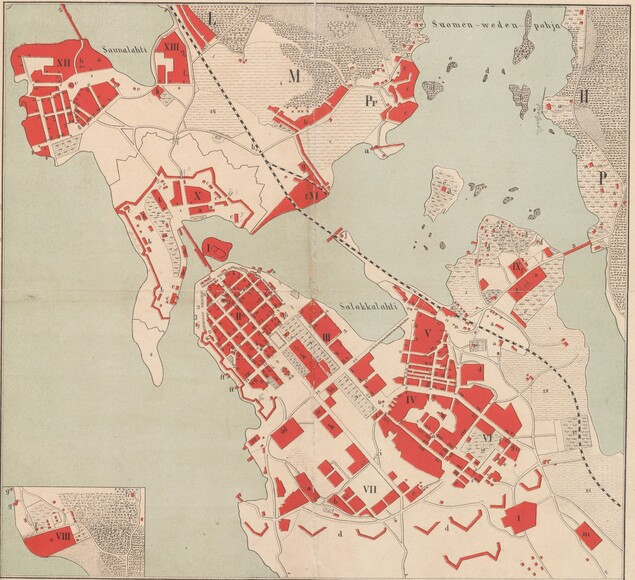

% Viipurin henkikirjojen puuttuvat ortodoksit
% Antti Härkönen
% 2022-21-21

# Johdanto

##

## Henkikirjat 1878 asetuksessa

- yhteiskuntaluokat
- värväys
- uskonto

# Syyt

## Neljä mahdollista selitystä puutteille:

1) tilastointialueiden muutos
2) identiteetin muutos
3) jäsenkätkentä
4) henkikirjoituksen toimittajan resurssit

# Tilastointialueet

## Muuttuva ja sekava Viipuri

- kaupunginosien väliset rajat ovat epäselviä
  * 1860 asemakaava hautasi alleen Pietarin esikaupungin
  * käytännössä kaupunginosa vaihtui uusiin tontti kerrallaan

##

##

## Viipurin maalaiskunta

- kaupungin rajojen (1817) ulkopuolelle syntyi epäsäännöllisiä esikaupunkeja 1870-luvulta alkaen
- kaupungin ja maalaiskunnan henkikirjojen rajat epäselviä
- ortodoksisissa srk voi olla jäseniä laajalta alueelta
- Viipurin mlk oli yksi Suomen suurimmista kaupungeista

# Identiteetti ja ilmoitushalukkuus

## Identiteetin muutos

- "ristiriitainen suhtautuminen ortodoksisuuteen" (Happonen 2009)
- ortodoksisuus politisoitui viimeistään Bobrikovin aikana
- ei selitä vuotuisia heilahteluja

## Viitseliäisyys

- 1881 useat edellisenä vuonna ortodoksisiksi merkityt perheet jätetty merkitsemättä
  * oletetaan olevan luterilaisia
  * (tämän takia kyselyissä ei pitäisi olla oletusvastauksia!)
- ilmoitushalukkuus on ilmeisesti matala
- alkuperäiset lomakkeet eivät ole säilyneet

## Jäsenkätkentä

- Kannaksen ort. srk jättivät jäseniään kirjaamatta (Loima 2002)
- halu välttää poliittisia konflikteja
- henkikirjojen sabotaasi?
  * passiivinen vastarinta venäläistämistä vastaan
  * perustuslaillisten kesken oli eriäviä mielipiteitä
  * tiettävästi koski vain asevelvollisten kirjaamista

# Henkikirjoittajat

## Kuka teki henkikirjat?

- henkikirjan allekirjoittat vaihtuvat säännöllisesti, monet vain 2 vuotta
- henkikirjoittajista vähän tietoa 1900-luvun puolelta
  * useimpia ei löydy valtiokalenterista tai lääninhallituksen nimikirjoista
  * vaikea saada tietoa mahdollisista venäläistämiseen liittyvistä potkuista

## Syyt eroihin

- joillakin selvästi pienempi määrä ortodokseja kuin toisilla
- eroja työinnossa?
  * jotkut ovat saattaneet korjata uskontotietoja edellisten vuosien perusteella