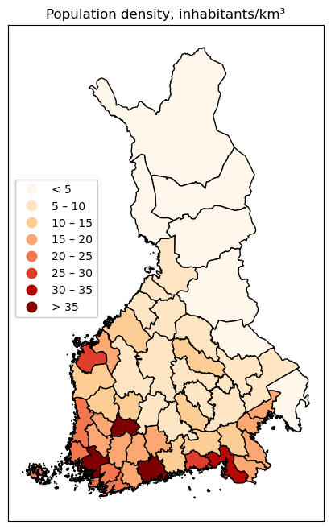

% Spatio-temporal dynamics of the last Finnish Variola epidemic, 1918–19
% Antti Härkönen
% 2023-11

# Introduction

## Variola

- Orthopox virus
- Smallpox, la petite vérole, isorokko, smittkoppor
- One of the deadliest diseases in history
  * 30 % mortality
  * 300 million dead in 20th century
  * Killed 20–30 % of Finnish children in the worst periods
- Wiped out by vaccination campaign in 1980

## Vaccination

- Jennerian vaccination in the late 1700s
- Mandatory vaccination for children in Finland in 1883
- Smallpox no longer endemic in Finland after 1890s

## However...

- Widespred vaccine hesitancy
- Kuhnean antivaccine movement popular in the 1910s
- Smallpox still endemic in Russia proper

# Finnish Civil War and Disease

## WWI

- Before the revolutions of 1917 Finland WWI affected Finland very little
- Several diseases spread near frontlines
  * German army suffered 1 dead from disease for every 10 KIA
- Influenza pandemic of 1918–19 killed 500 million people world wide

## Finnish Civil War

- Peacetime medical infrastructure breaks down
- Reds had much worse medical corps than Whites
  * Did not trust doctors
- Large movements of people
  * Armies
  * Refugees
  * Economic migrants due to famine conditions
  * Prisoner transfers
- People crammed in barracks and in prison camps

## Smallpox in Civil War

- Local smallpox cases in Karelian Isthmus in 1916
- Several outbreaks during and after the civil war
- Smallpox spread among Red troops and then in prison camps
  * 3000 cases and 900 deaths

## Civilian cases

- Recruits and prisoners returning spread cases
- In many areas civilians did not recognise the disease as smallpox
- Origin sometimes unknown
  * Doctors suspected Variola had spread from Russia
- One large wave at the end of the Civil War
- Second, more dispersed wave in early 1919

##

## Prevention of smallpox

- Quarantining was the most important way of prevention
- Increased vaccination, targeted vaccination efforts
  * Similar to later WHO eradication campaign!
  * White troops and red prisoners vaccinated
- Desinfections of barracks

## Eastern Border

- Refugees from Russia often had smallpox infections
- Mandatory checks at the border, quarantine hospital

# Data

## Healthcare districts

- Finland was divided into 53 medical districts *piirilääkäripiiri*
- The area of districts evolved over time
- Each had a district medical officer (*piirilääkäri*) charged with reporting on local conditions
  * Medical statistics do not correspond to other statistical units
- Cities had their own medical boards

## Medical data

- Annual reports of the Central Medical Board (*Lääkintöhallitus*) report diseases by medical districts and cities
- These do not include the many cases in garrisons and prison camps
- No good data on vaccine coverage

## Spatial data

- Finnish municipalities in 1918 digitized, then combined into medical districts
- Cities are included in the district that surrounds them, in reality they were independent units

# Geospatial analysis

## Distance to Russia and Variola

- *x_i* distance to Russian border (km) was measured for each medical district *i*
- *y_i* incidence of Variola in the year 

##

## Bayesian spatial Poisson regression

- Incidence is modelled with a type of Generalised Linear Model (GLM),
where the response variable is Poisson-distributed
- Bayesian regression:
  * Distribution of model parameters are estimated based on data
  * Data is a given, model parameters vary
  * Prior distributions incorporate prior knowledge

## Model (1/2)

$$ y_i \sim Poisson(\lambda_i) $$
$$ \log{\lambda_i} = \beta_0 + \beta_1 x_i + \theta_i + \phi_i $$
$$ \beta_0 \sim Normal(\mu=4, \sigma=0.05) $$
$$ \beta_1 \sim Normal(\mu=0, \sigma=0.05) $$

## Model (2/2)

$$ \theta_i \sim Normal(\mu=0, \tau=\tau_{independent}) $$
$$ \phi | \phi_{j~i} \sim Normal(\mu=\alpha \sum^{n_i}_{j=1} \phi_j, \tau=\tau_{spatial}) $$
$$ \tau_{independent} \sim Gamma(\alpha=1, \beta=1) $$
$$ \tau_{spatial} \sim Gamma(\alpha=1, \beta=1) $$

## Results

- 95 % credible interval (CI) for *β_1* indicates significant effect of distance to Russia (*x_i*)
  * 1918 CI: from -0.0064 to -0.00078
  * 1919 CI: from -0.014 to -0.0028
  * very small numbers are explained by the fact *x_i* is measured in hundreds of km

# The two waves

## 1918 vs 1919

- Two distinct peaks in reported civilian smallpox cases
- End of the Civil War, May 1918
- Winter and Spring 1919

## 

## Local patterns

1. Two peaks
2. Peak in 1918, no peak in 1919
3. No peak in 1918, peak in 1919
4. Very few or no cases

## 1. Two peaks

- Karelian Isthmus and Ladoga coast
- Areas most dependent on Petrograd before 1917
- Tampere region
  * The city itself had high vaccination rate
- Kuopio: first wave from prisoners, second wave from North Karelia

##

## 2. Peak in 1918, no peak in 1919

- Historic Tavastia and Birkaland, except Tampere

##

## 3. No peak in 1918, peak in 1919

- Areas outside of the most intensive fighting in the Civil War
- Mostly areas influenced by Viipuri and Petrograd (before 1917)
- Pori district in the west

##

## 4. Very few or no cases

- Northernmost Finland was safe, likely due to the very low population density
- Western islands protected by Baltic sea
- Smallpox needed higher population density to survive than the Spanish flu

##

# Summary

## Russian influence

- Distance to Russia explains east-west differences within Finland
- Finnish civil war explains outbreaks in the south
- Quarantine hospital at border prevented many outbreaks

## Smallpox

- The problems faced by medical professionals were almost exactly the same as the ones during COVID-19
- Data quality and lack of digitisation are huge problems
- Variola virus is the only pathogen ever to be extinguished by humans
