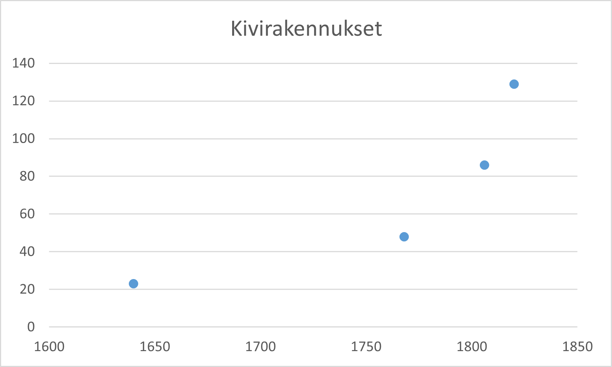

% Viipurin kivettyminen 1640-1860
% Antti Härkönen
% 2022-02-09

# Johdanto

## Viipuri uuden ajan alussa

- vahvasti linnoitettu
- paikallinen hallinto- ja kauppakeskus
- venäläinen varuskuntakaupunki 1710 alk.
- suomen-, saksan-, ruotsin- ja venäjänkielinen väestö

## Viipurin keskustan muutos

- 1600-luvun alussa muutama pieni kivirakennus
- 1860 suuri enemmistö kivirakennuksia
- enemmistössä silti 2-kerrosta

##

## Regulaatio

- Per Brahe ja maanmittarit
- "luonnollisista" kaduista kankeaan ruutukaavaan

## Paloturvallisuus

- säännölliset tulipalot tuhosivat puutalokortteleita
- ruotsalaiset ja venäläiset sotilasviranomaiset vaativat kivirakennuksia

## Esikaupungit

- muurien ulkopuolella
- ei kivirakennuksia (kielletty muurien lähellä)
- sekä 1640 että 1860 muurien sisäpuolinen alue selvästi rikkain osa

# Teoria

## Segregaatiotutkimus

- hypoteesi: rakennusmateriaalin rajoitus vahvistaa segregaatiota varallisuuden mukaan
- puurakennuksia palaa ja puratetaan jokaisen suurpalon jälkeen, kivirakennukset korjataan
- tonttirajat kestävät, kun ne perustuvat kivirakennuksiin

# Metodit

## Diakroninen analyysi

- rakennuskannan muutos ja varallisuuden alueellinen keskittyminen

## Talojen laskenta

- kivirakennuksen määritelmä vaihtelee lähteissä
- holvikellarit lasketaan mukaan, kivijalkoja ei

## Karttojen digitointi

- [Viipurin digitaalinen atlas](https://arcg.is/0qbqzC0)
- rakennukset vektorimuodossa

## MAUP

- muuttuvien alueyksiköiden ongelma (MAUP)
- geoinformatiikan avulla alueet saadaan keskenään vertailukelpoisiksi

# Lähteet

## Rakennuskanta

- kartat 1640, 1768, 1820
- väestönlaskennat 1870 alk.
- muut maininnat (1806 ym.)

##

## Varallisuus

- henkikirja 1600-l.
- kunnallisveroluettelo 1800-l.
- veronmaksu ei suoraan vertailtavissa

# Tutkimuksen merkitys

## Uuden ajan alun kaupungit

- [Sortavala-artikkeli](https://doi.org/10.1177/00961442211037313)
- Gideon Sjöbergin esiteollinen kaupunki (*The Pre-Industrial City: Past and Present*, 97-101)
- kaupunkien keskusta ja eliitin statuksen korostaminen

## Pitkän ajan segregaatio

- voiko sitä mitata
- paljon ongelmia
